# Repo Radar
**Live demo:** https://repo-radar-platform.vercel.app/

A dashboard where you can search GitHub repos, track the ones you care about, and keep an eye on their stats (stars, forks, open issues, last commit, languages) without having to go back to GitHub every time.

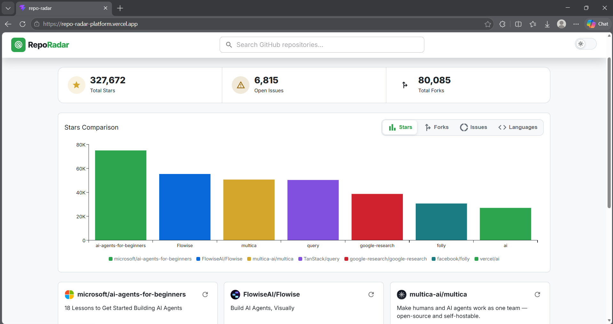

---

## Tech stack

- React 19 + TypeScript
- Redux Toolkit + RTK Query (state + data fetching)
- MUI 
- Framer Motion 
- GitHub REST API (`api.github.com`)
- Vite
- Storybook 
- Monorepo: shared UI and charts split into their own packages

---

## Running it locally

```bash
git clone https://github.com/Mayamohamed207/repo-radar.git
cd repo-radar
npm install
npm run dev
```

To run Storybook:

```bash
npm run storybook
```
---

## What it does

**Search**
- Debounced search against GitHub's repo search API (waits 500ms after you stop typing before firing a request, so it's not spamming the API on every keystroke)
- Pagination via a "Load more" button, pages accumulate as you click
- Loading skeletons, an empty state, and error messages based on what actually failed
- If "Load more" fails, the results you already have stay on screen and the button changes to "Try again"

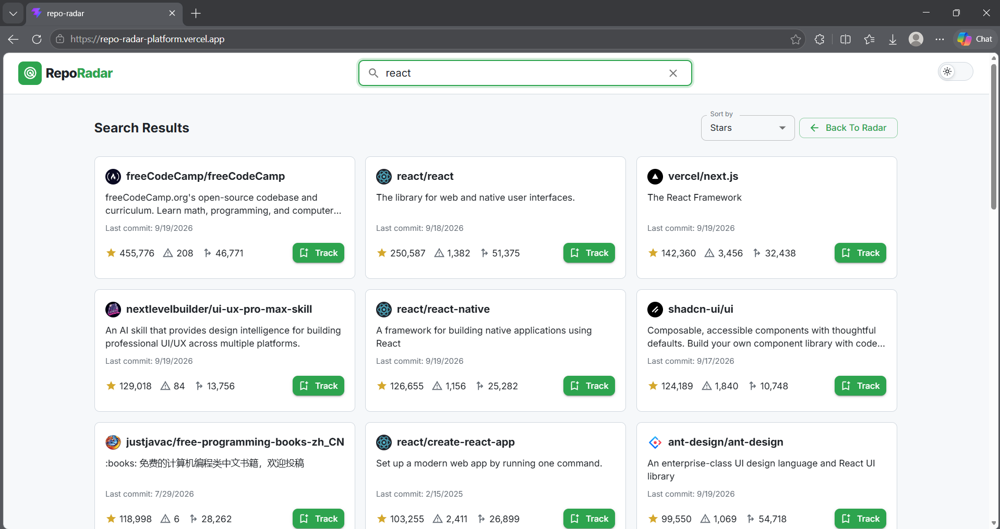
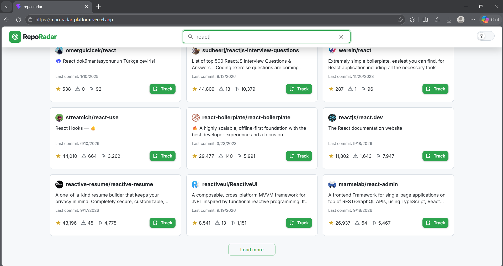

**Tracking**
- Track / untrack any repo from search results
- Tracked repos persist in `localStorage`, so refreshing the page doesn't lose your list
- Each tracked repo shows live stats: stars, open issues, forks, last commit date
- Refresh a single repo, or hit "Refresh All" to pull fresh data for everything you're tracking
- Each card has its own independent loading and error state, so if one repo fails to refresh it doesn't break the rest
- Cards are clickable and open the repo on GitHub in a new tab

<p align="center"> 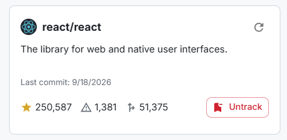 </p>

**Charts**
- Bar chart comparing stars across tracked repos, plus forks, open issues and languages

| Stars | Forks |
|---|---|
| 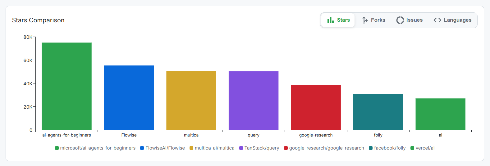 | 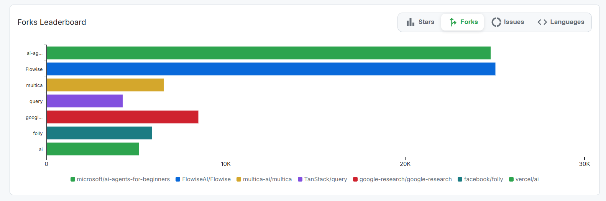 |
| **Open issues** | **Languages** |
| 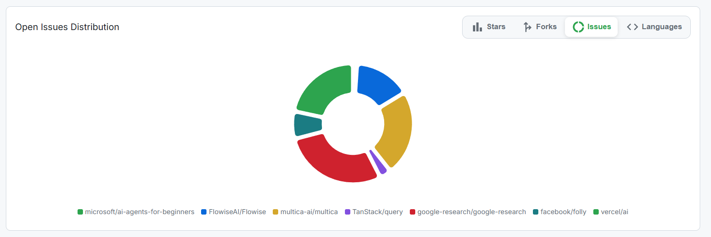 | 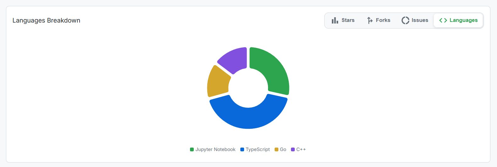 |

---

## Additional Features

- **Monorepo architecture:** the app is split into three npm workspaces: `apps/web` (the app itself), `packages/ui` (generic components like `Logo`, `Navbar`, `RepoStatsRow`, `SortSelect`), and `packages/charts` (the chart tab switcher and all four chart types).
- **Storybook:** stories for the main UI pieces (`RepoCard`, `TrackedCard`, `SearchBar`, `SearchResults`, `Navbar`, `ChartsContainer`), including loading, error and empty states for the ones that depend on the API.
- **Theme switching:** dark/light toggle, saved automatically by MUI's color scheme storage.

| Light | Dark |
|---|---|
| 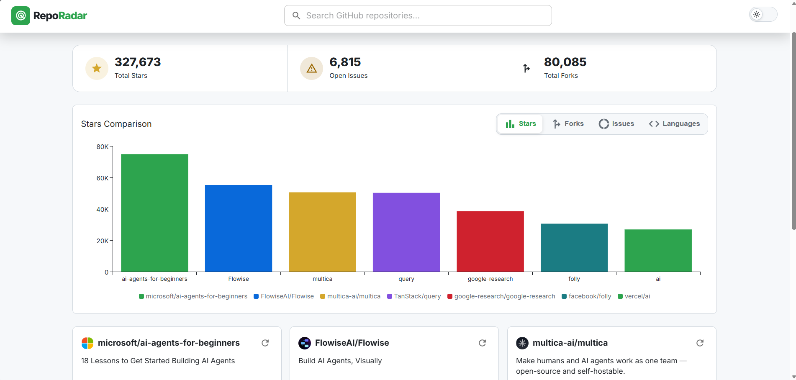 | 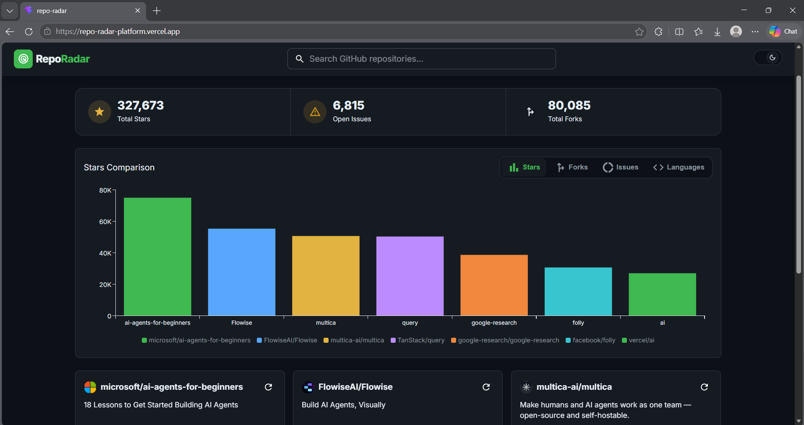 |

- **Extra charts:** forks leaderboard, open issues donut, languages breakdown, in addition to the required stars chart.
- **Clickable repo cards** — cards in both the search results and the tracked list open the repo on GitHub in a new tab
- **A stats strip:** totals stars, issues and forks across everything tracked.
- **Sort options:** search results and tracked repos can be sorted (stars, forks, open issues, recently updated).

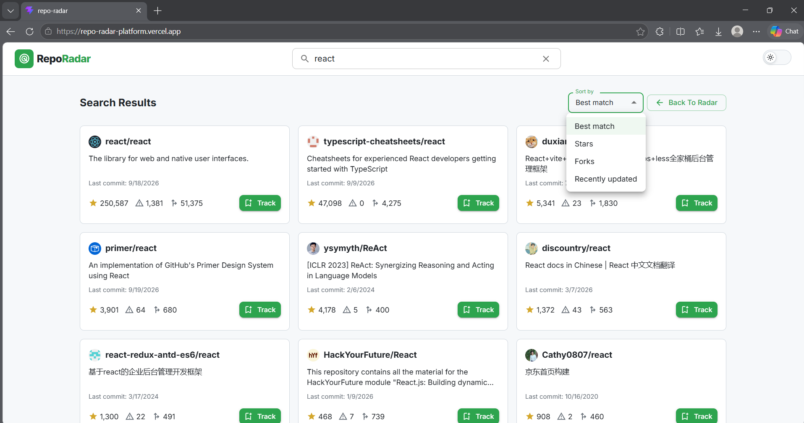

- **Toast notifications:** feedback when tracking or untracking a repo.
- **Responsive layout with Framer Motion animations.**

| Mobile | Tablet |
|---|---|
| 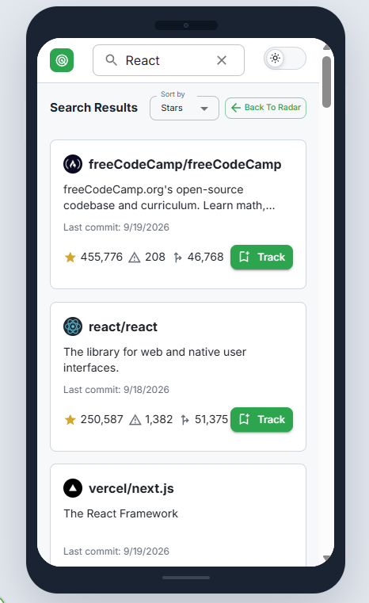 | 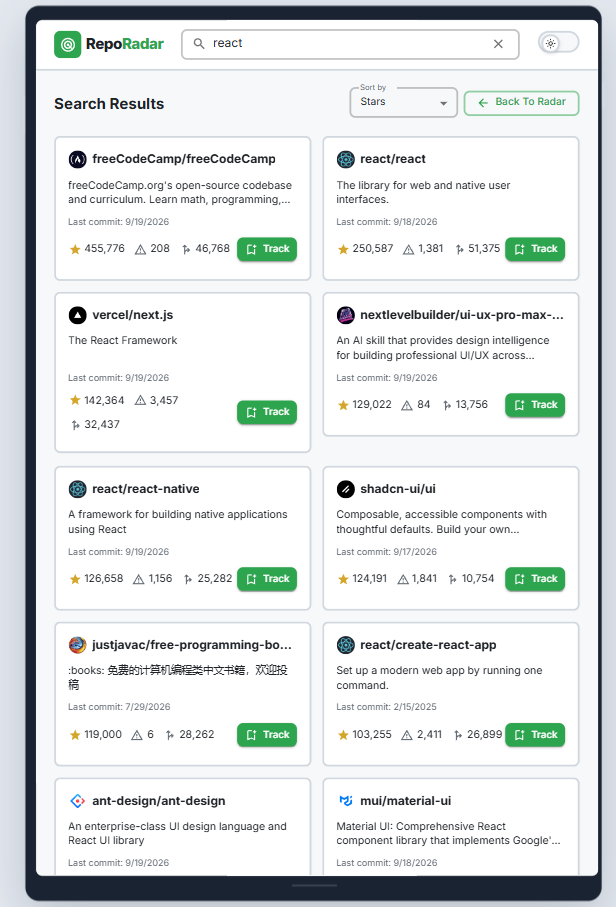 |

**Desktop**
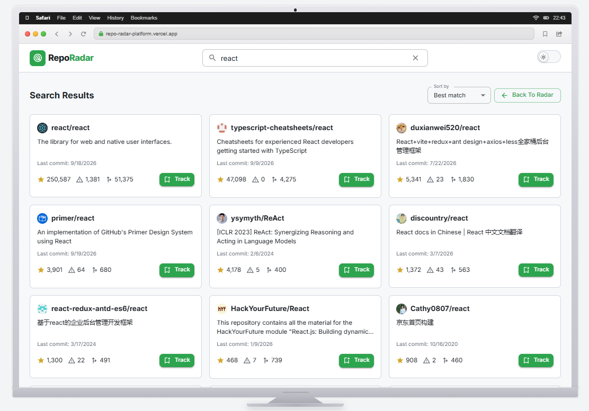

---

## Storybook

**SearchResults states (loading, empty, error)**

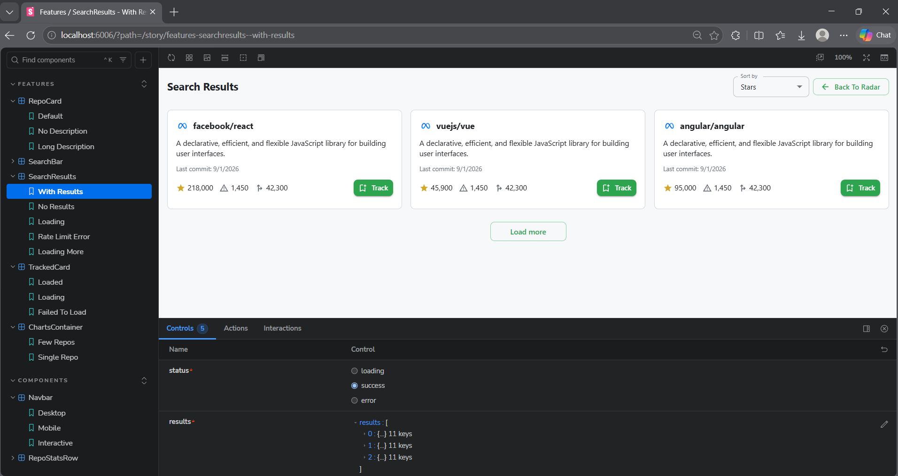

**Charts**

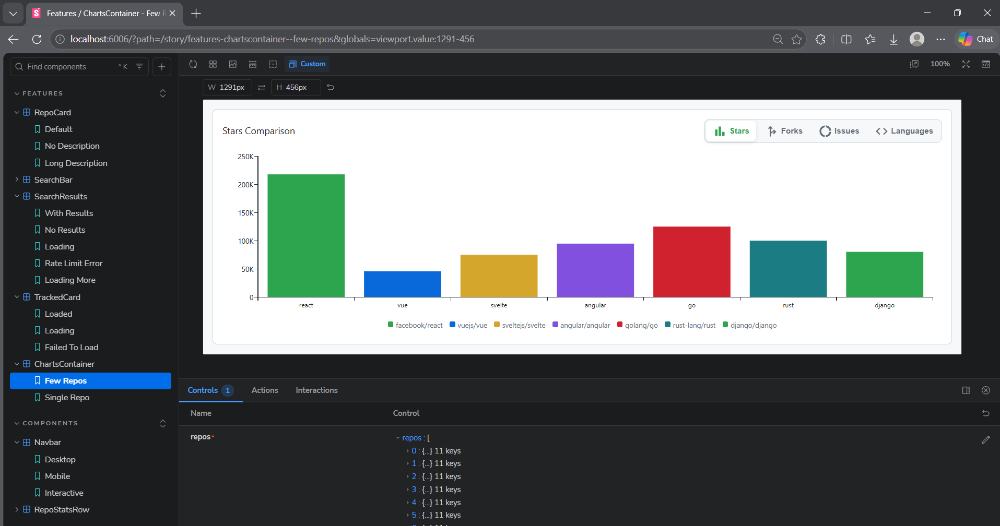

---

## Folder structure

```
repo-radar/
  apps/
    web/                  The actual application
      src/
        api/              GitHub API setup (RTK Query endpoints) and a helper
                          that reads the status code from a failed request
        features/
          search/         Everything about searching: SearchBar, SearchResults,
                          RepoCard, and useRepoSearch (the hook that owns the
                          whole search flow: debounce, pagination, status)
          tracked/        Everything about tracked repos: TrackedCard, TrackedView,
                          StatsBar, the Redux slice, useTrackedRepoData
        providers/        App-wide React Context providers (toasts)
        hooks/            Small reusable hooks 
        store/            Redux store setup
        theme/            MUI theme
        styles/           CSS variables (light/dark tokens)
        types/            Shared TypeScript types
        test/             Sample data used by the Storybook stories
      .storybook/         Storybook config
  packages/
    ui/                   Generic components used across the app: Logo, Navbar,
                          RepoStatsRow, SortSelect. Imported as @repo-radar/ui
    charts/               The chart tab switcher and all four chart types
                          (stars, forks, issues, languages). Imported as
                          @repo-radar/charts
```

---

## Architecture and technical decisions

**Why a monorepo.** Splitting `ui` and `charts` into their own packages keeps them reusable and independent of the app: `ui` knows nothing about Redux, and `charts` just takes an array of repos. New apps or packages can be added without restructuring. Unlike a polyrepo, where every shared change means publishing a package and versions in each consumer, npm workspaces link everything locally, so changes show up in the app immediately, with one clone and one `npm install`.

**Why RTK Query instead of `useState` + `fetch`.** Caching, loading/error flags, and refetching come built in. This matters most for independent loading states: each `TrackedCard` calls `useGetRepoByFullNameQuery` on its own, so it gets its own `isFetching` and `isError` with no manual wiring between components. If one repo's request fails (deleted repo, rate limit), the others are unaffected.

**Tracked repos store only `{ id, full_name }`.** The Redux slice never stores stats. Stars, issues and forks always come from RTK Query's cache, so there is one place that knows a repo's current numbers instead of two copies that could drift apart. `localStorage` saves only the list of tracked repos, so a page reload always fetches fresh stats. The dashboard reads each tracked repo's cached data through a small hook, `useTrackedRepoData`, and it only re-renders when a repo's data actually changes.

**Failures aren't all the same failure.** A 404 means the repo was deleted or renamed, while a 403 means the rate limit was hit. `TrackedCard` checks the actual status and shows a matching message instead of a generic "something went wrong". Search works the same way: 403 or 429 shows the search limit message, 422 says GitHub couldn't run the search, and anything else gets a generic message.

**Search pagination lives in one place.** Debouncing, accumulating pages as "Load more" gets clicked, resetting to page 1 when the term or sort changes, and turning RTK Query's raw loading/error flags into one status and one error message all happen in a single hook, `useRepoSearch`. `App.tsx` just renders what the hook returns.

**Toasts live in Context, not Redux.** Track/untrack confirmations are short-lived UI feedback, not app data, so they don't need to go through the store.

---

## Limitations

- **Rate limits.** Unauthenticated GitHub API calls are capped at 60 requests/hour. Tracking a handful of repos and hitting "Refresh All" a few times can get you there faster than you'd expect. There's a visible error state for this.
- **"Recently updated" isn't strictly "last commit."** GitHub's `sort=updated` on search results is based on the repo's general `updated_at` field, which can shift from things other than pushes. It's usually close to last commit but not a guaranteed match.